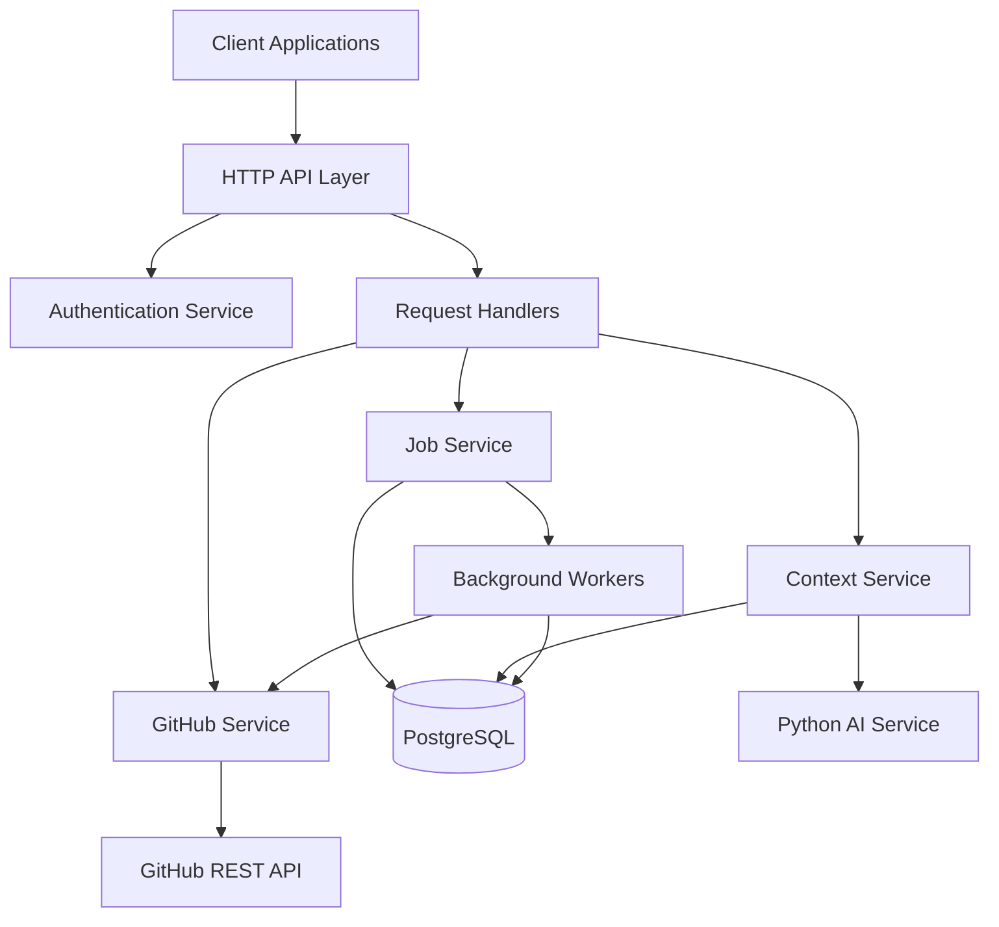

# Design Document: ContextKeeper Go Backend

## Overview

The ContextKeeper Go Backend is a lightweight, standards-compliant HTTP service that orchestrates GitHub repository data ingestion, storage, and AI-powered context queries. Built exclusively with Go's standard library, it follows a clean architecture pattern with clear separation between HTTP handlers, business logic, and data access layers.

The system operates as a stateless service that coordinates between three external systems: GitHub's REST API for data extraction, PostgreSQL for normalized storage, and a Python AI service for context processing. The architecture prioritizes simplicity, fail-fast error handling, and efficient resource utilization.

## Architecture

### High-Level Architecture



### Service Layer Architecture

The backend follows a layered architecture pattern:

1. **HTTP Layer**: Request routing, middleware, and response handling
2. **Service Layer**: Business logic and orchestration
3. **Repository Layer**: Data access and persistence
4. **External Integration Layer**: GitHub API and AI service clients

### Key Architectural Decisions

- **Standard Library Only**: No external frameworks to minimize dependencies and maintain simplicity
- **Fail-Fast Design**: Immediate error responses without complex retry mechanisms
- **Sequential Processing**: Simple goroutine-based background jobs without persistent queues
- **Stateless Design**: No in-memory caching or session state
- **Normalized Storage**: Relational schema for efficient queries and data integrity

## Components and Interfaces

### HTTP Server Component

**Responsibilities:**
- Route HTTP requests to appropriate handlers
- Apply authentication middleware
- Handle CORS and basic security headers
- Manage request timeouts and graceful shutdown

**Key Interfaces:**
```go
type Server struct {
    router   *http.ServeMux
    authSvc  AuthService
    repoSvc  RepositoryService
    jobSvc   JobService
    ctxSvc   ContextService
}

type Handler interface {
    ServeHTTP(w http.ResponseWriter, r *http.Request)
}
```

### Authentication Service

**Responsibilities:**
- Handle GitHub OAuth flow
- Generate and validate JWT tokens
- Extract user information from tokens

**Key Interfaces:**
```go
type AuthService interface {
    HandleGitHubCallback(code string) (*AuthResponse, error)
    ValidateJWT(token string) (*UserClaims, error)
    GenerateJWT(userID string, githubToken string) (string, error)
}

type UserClaims struct {
    UserID      string
    GitHubToken string
    ExpiresAt   int64
}
```

### GitHub Service

**Responsibilities:**
- Authenticate with GitHub API using user tokens
- Fetch repository metadata with rate limiting
- Handle GitHub API errors and pagination

**Key Interfaces:**
```go
type GitHubService interface {
    GetUserRepos(token string) ([]Repository, error)
    GetPullRequests(token, owner, repo string, limit int) ([]PullRequest, error)
    GetIssues(token, owner, repo string, limit int) ([]Issue, error)
    GetCommits(token, owner, repo string, limit int) ([]Commit, error)
}

type GitHubClient struct {
    httpClient *http.Client
    baseURL    string
}
```

### Job Service

**Responsibilities:**
- Create and manage ingestion jobs
- Coordinate background processing
- Track job status and errors

**Key Interfaces:**
```go
type JobService interface {
    CreateIngestionJob(repoID int64, userID string) (*IngestionJob, error)
    GetJobStatus(jobID int64) (*IngestionJob, error)
    ProcessJob(job *IngestionJob) error
}

type IngestionJob struct {
    ID         int64
    RepoID     int64
    Status     JobStatus
    StartedAt  *time.Time
    FinishedAt *time.Time
    ErrorMsg   *string
}
```

### Context Service

**Responsibilities:**
- Filter repository data for AI service
- Coordinate with Python AI service
- Handle AI service timeouts and errors

**Key Interfaces:**
```go
type ContextService interface {
    ProcessQuery(repoID int64, query string) (*ContextResponse, error)
    FilterRepoData(repoID int64) (*FilteredRepoData, error)
}

type FilteredRepoData struct {
    PullRequests []PullRequest `json:"pull_requests"`
    Issues       []Issue       `json:"issues"`
    Commits      []Commit      `json:"commits"`
}
```

### Repository Layer

**Responsibilities:**
- Database connection management
- CRUD operations for all entities
- Transaction management
- Query optimization

**Key Interfaces:**
```go
type RepositoryStore interface {
    CreateRepo(repo *Repository) error
    GetReposByUser(userID string) ([]Repository, error)
    CreatePullRequest(pr *PullRequest) error
    CreateIssue(issue *Issue) error
    CreateCommit(commit *Commit) error
    GetRecentPRs(repoID int64, limit int) ([]PullRequest, error)
    GetRecentIssues(repoID int64, limit int) ([]Issue, error)
    GetRecentCommits(repoID int64, limit int) ([]Commit, error)
}
```

## Data Models

### Core Entities

**Repository**
```go
type Repository struct {
    ID        int64     `json:"id"`
    Name      string    `json:"name"`
    FullName  string    `json:"full_name"`
    Owner     string    `json:"owner"`
    CreatedAt time.Time `json:"created_at"`
    UpdatedAt time.Time `json:"updated_at"`
}
```

**Pull Request**
```go
type PullRequest struct {
    ID           int64     `json:"id"`
    RepoID       int64     `json:"repo_id"`
    Number       int       `json:"number"`
    Title        string    `json:"title"`
    Body         string    `json:"body"`
    Author       string    `json:"author"`
    State        string    `json:"state"`
    CreatedAt    time.Time `json:"created_at"`
    MergedAt     *time.Time `json:"merged_at"`
    FilesChanged []string  `json:"files_changed"`
    Labels       []string  `json:"labels"`
}
```

**Issue**
```go
type Issue struct {
    ID        int64     `json:"id"`
    RepoID    int64     `json:"repo_id"`
    Title     string    `json:"title"`
    Body      string    `json:"body"`
    Author    string    `json:"author"`
    State     string    `json:"state"`
    CreatedAt time.Time `json:"created_at"`
    ClosedAt  *time.Time `json:"closed_at"`
    Labels    []string  `json:"labels"`
}
```

**Commit**
```go
type Commit struct {
    SHA          string    `json:"sha"`
    RepoID       int64     `json:"repo_id"`
    Message      string    `json:"message"`
    Author       string    `json:"author"`
    CreatedAt    time.Time `json:"created_at"`
    FilesChanged []string  `json:"files_changed"`
}
```

**Ingestion Job**
```go
type IngestionJob struct {
    ID         int64      `json:"id"`
    RepoID     int64      `json:"repo_id"`
    Status     JobStatus  `json:"status"`
    StartedAt  *time.Time `json:"started_at"`
    FinishedAt *time.Time `json:"finished_at"`
    ErrorMsg   *string    `json:"error_message"`
}

type JobStatus string

const (
    JobStatusPending   JobStatus = "pending"
    JobStatusRunning   JobStatus = "running"
    JobStatusCompleted JobStatus = "completed"
    JobStatusPartial   JobStatus = "partial"
    JobStatusFailed    JobStatus = "failed"
)
```

### Database Schema

**Tables and Relationships:**

```sql
-- Repositories table
CREATE TABLE repos (
    id BIGSERIAL PRIMARY KEY,
    name VARCHAR(255) NOT NULL,
    full_name VARCHAR(255) NOT NULL UNIQUE,
    owner VARCHAR(255) NOT NULL,
    created_at TIMESTAMP WITH TIME ZONE DEFAULT NOW(),
    updated_at TIMESTAMP WITH TIME ZONE DEFAULT NOW()
);

-- Pull requests table
CREATE TABLE pull_requests (
    id BIGINT PRIMARY KEY,
    repo_id BIGINT NOT NULL REFERENCES repos(id) ON DELETE CASCADE,
    number INTEGER NOT NULL,
    title TEXT NOT NULL,
    body TEXT,
    author VARCHAR(255) NOT NULL,
    state VARCHAR(50) NOT NULL,
    created_at TIMESTAMP WITH TIME ZONE NOT NULL,
    merged_at TIMESTAMP WITH TIME ZONE,
    files_changed JSONB,
    labels JSONB,
    UNIQUE(repo_id, number)
);

-- Issues table
CREATE TABLE issues (
    id BIGINT PRIMARY KEY,
    repo_id BIGINT NOT NULL REFERENCES repos(id) ON DELETE CASCADE,
    title TEXT NOT NULL,
    body TEXT,
    author VARCHAR(255) NOT NULL,
    state VARCHAR(50) NOT NULL,
    created_at TIMESTAMP WITH TIME ZONE NOT NULL,
    closed_at TIMESTAMP WITH TIME ZONE,
    labels JSONB
);

-- Commits table
CREATE TABLE commits (
    sha VARCHAR(40) PRIMARY KEY,
    repo_id BIGINT NOT NULL REFERENCES repos(id) ON DELETE CASCADE,
    message TEXT NOT NULL,
    author VARCHAR(255) NOT NULL,
    created_at TIMESTAMP WITH TIME ZONE NOT NULL,
    files_changed JSONB
);

-- Ingestion jobs table
CREATE TABLE ingestion_jobs (
    id BIGSERIAL PRIMARY KEY,
    repo_id BIGINT NOT NULL REFERENCES repos(id) ON DELETE CASCADE,
    status VARCHAR(50) NOT NULL DEFAULT 'pending',
    started_at TIMESTAMP WITH TIME ZONE,
    finished_at TIMESTAMP WITH TIME ZONE,
    error_message TEXT
);

-- Indexes for performance
CREATE INDEX idx_repos_owner ON repos(owner);
CREATE INDEX idx_pull_requests_repo_created ON pull_requests(repo_id, created_at DESC);
CREATE INDEX idx_pull_requests_repo_author ON pull_requests(repo_id, author);
CREATE INDEX idx_issues_repo_created ON issues(repo_id, created_at DESC);
CREATE INDEX idx_issues_repo_author ON issues(repo_id, author);
CREATE INDEX idx_commits_repo_created ON commits(repo_id, created_at DESC);
CREATE INDEX idx_commits_repo_author ON commits(repo_id, author);
CREATE INDEX idx_ingestion_jobs_repo ON ingestion_jobs(repo_id);
```

## Error Handling

### Error Classification

**Client Errors (4xx):**
- 400 Bad Request: Malformed JSON, invalid parameters
- 401 Unauthorized: Missing or invalid JWT token
- 403 Forbidden: Valid token but insufficient permissions
- 404 Not Found: Repository or resource not found
- 429 Too Many Requests: Rate limiting (if implemented)

**Server Errors (5xx):**
- 500 Internal Server Error: Database errors, unexpected failures
- 502 Bad Gateway: GitHub API or AI service unavailable
- 504 Gateway Timeout: AI service timeout exceeded

### Error Response Format

```go
type ErrorResponse struct {
    Error   string `json:"error"`
    Message string `json:"message"`
    Code    int    `json:"code"`
}
```

### Error Handling Strategy

1. **Fail-Fast Principle**: Return errors immediately without retries
2. **Structured Logging**: Log all errors with context for debugging
3. **Graceful Degradation**: Continue processing other items when individual items fail
4. **Clear Error Messages**: Provide actionable error information to clients

## Testing Strategy

### Dual Testing Approach

The testing strategy combines unit tests for specific scenarios and property-based tests for comprehensive validation:

**Unit Tests:**
- HTTP handler behavior with various inputs
- Authentication token validation edge cases
- Database transaction rollback scenarios
- GitHub API error response handling
- AI service timeout behavior

**Property-Based Tests:**
- Data consistency across ingestion operations
- API response format validation
- Database constraint enforcement
- JWT token generation and validation cycles

### Property-Based Testing Configuration

Using Go's built-in testing package with custom property test helpers:
- Minimum 100 iterations per property test
- Each test tagged with feature and property reference
- Random data generation for comprehensive input coverage
- Focused on universal properties that must hold for all valid inputs

### Test Organization

```
tests/
├── unit/
│   ├── handlers_test.go
│   ├── auth_test.go
│   ├── github_test.go
│   └── repository_test.go
├── integration/
│   ├── api_test.go
│   └── database_test.go
└── properties/
    ├── ingestion_properties_test.go
    ├── auth_properties_test.go
    └── data_consistency_properties_test.go
```

Each property test includes a comment referencing its design document property:
```go
// Feature: contextkeeper-go-backend, Property 1: Authentication round trip consistency
func TestAuthenticationRoundTrip(t *testing.T) { ... }
```

## Correctness Properties

*A property is a characteristic or behavior that should hold true across all valid executions of a system—essentially, a formal statement about what the system should do. Properties serve as the bridge between human-readable specifications and machine-verifiable correctness guarantees.*

### Property 1: OAuth Scope Consistency
*For any* GitHub OAuth request initiated by the system, the requested scopes should always include exactly: public_repo, read:user, user:email
**Validates: Requirements 1.1**

### Property 2: JWT Authentication Round Trip
*For any* successful GitHub OAuth flow, generating a JWT token and then validating it should preserve the user identity and GitHub token information
**Validates: Requirements 1.3, 1.5**

### Property 3: Repository Data Extraction Limits
*For any* repository ingestion operation, the system should extract at most 50 pull requests, 50 issues, and 100 commits, ordered by most recent timestamp, regardless of how many items exist in the repository
**Validates: Requirements 2.2, 2.3, 2.4, 10.1, 10.2, 10.3**

### Property 4: Repository Metadata Field Extraction
*For any* repository data item, only the specified metadata fields should be extracted and stored: PRs (id, number, title, body, author, state, created_at, merged_at, files_changed, labels), Issues (id, title, body, author, state, created_at, closed_at, labels), Commits (sha, message, author, created_at, files_changed)
**Validates: Requirements 3.1, 3.2, 3.3**

### Property 5: Structured Array Serialization
*For any* multi-valued metadata fields (files_changed, labels), the system should serialize them as valid JSONB arrays that can be round-trip deserialized to equivalent values
**Validates: Requirements 3.4, 3.5**

### Property 6: Ingestion Job Lifecycle
*For any* ingestion job, status transitions should follow the valid sequence: pending → running → (completed|partial|failed), with appropriate timestamps and error messages persisted for each state change
**Validates: Requirements 4.1, 4.2, 4.3, 4.4, 4.5, 4.6**

### Property 7: AI Context Payload Filtering
*For any* context query, the system should send exactly the most recent 10 pull requests, 10 issues, and 20 commits to the AI service, without performing semantic relevance filtering
**Validates: Requirements 6.1, 6.2, 6.3, 6.7, 10.4, 10.5, 10.6**

### Property 8: AI Service Timeout Enforcement
*For any* AI service call, if the response takes longer than 30 seconds, the system should immediately return a timeout error without waiting further
**Validates: Requirements 6.4, 6.5**

### Property 9: Backend API Authentication Enforcement
*For any* API endpoint request (except OAuth callback), the system should validate JWT authentication before processing and expose action-based REST endpoints with structured JSON responses
**Validates: Requirements 5.1, 5.2, 5.3, 5.4, 5.5, 5.6, 8.4**

### Property 10: Fail-Fast Error Handling
*For any* error condition (external service failures, malformed requests, database failures), the system should return immediate error responses with appropriate HTTP status codes and descriptive messages, without background retries beyond a single attempt
**Validates: Requirements 2.6, 8.1, 8.2, 8.3, 8.4, 8.5**

## Error Handling

### Error Classification and Response Strategy

**Authentication Errors:**
- Invalid JWT tokens → 401 Unauthorized with clear message
- Missing authentication → 401 Unauthorized
- Expired tokens → 401 Unauthorized with expiration notice

**Client Request Errors:**
- Malformed JSON → 400 Bad Request with parsing details
- Missing required fields → 400 Bad Request with field specification
- Invalid repository IDs → 404 Not Found

**External Service Errors:**
- GitHub API failures → Log error, continue processing, mark job as partial if needed
- GitHub rate limiting → Handle gracefully, mark job as partial
- AI service timeouts → 504 Gateway Timeout, no retries
- AI service failures → 502 Bad Gateway, no retries

**Database Errors:**
- Connection failures → 500 Internal Server Error
- Constraint violations → 400 Bad Request with constraint details
- Transaction failures → 500 Internal Server Error with rollback

### Error Response Format

All errors follow a consistent JSON structure:
```json
{
  "error": "error_type",
  "message": "Human-readable description",
  "code": 400
}
```

### Logging Strategy

- **Error Level**: All 5xx errors, external service failures
- **Warn Level**: 4xx errors, rate limiting, partial job completions
- **Info Level**: Successful operations, job status changes
- **Debug Level**: Request/response details, timing information

## Testing Strategy

### Dual Testing Approach

The testing strategy combines unit tests for specific scenarios and property-based tests for comprehensive validation:

**Unit Tests:**
- HTTP handler behavior with various request formats
- Authentication edge cases (expired tokens, malformed JWTs)
- Database transaction rollback scenarios
- GitHub API error response handling
- AI service timeout and error scenarios
- JSON serialization/deserialization edge cases

**Property-Based Tests:**
- Universal properties that must hold across all valid inputs
- Data consistency across ingestion operations
- API response format validation across all endpoints
- Database constraint enforcement with random data
- JWT token generation and validation cycles
- Error handling consistency across different failure modes

### Property-Based Testing Configuration

Using Go's built-in testing package with custom property test framework:
- **Minimum 100 iterations** per property test for thorough coverage
- **Random data generation** for comprehensive input space exploration
- **Shrinking support** to find minimal failing examples
- **Deterministic seeding** for reproducible test runs

Each property test includes a comment referencing its design document property:
```go
// Feature: contextkeeper-go-backend, Property 1: OAuth Scope Consistency
func TestOAuthScopeConsistency(t *testing.T) {
    // Property test implementation
}
```

### Test Data Management

**Test Database:**
- Isolated test database per test suite
- Automatic schema migration before tests
- Transaction rollback after each test
- Seed data generation for consistent test scenarios

**Mock Services:**
- GitHub API mock server for controlled responses
- AI service mock for timeout and error simulation
- JWT token generation utilities for authentication tests

### Integration Testing

**API Integration Tests:**
- End-to-end request/response cycles
- Authentication flow validation
- Database persistence verification
- Error propagation testing

**External Service Integration:**
- GitHub API integration with real endpoints (limited)
- Database integration with real PostgreSQL instance
- AI service integration with mock responses

The testing approach ensures both specific edge cases are covered through unit tests and universal correctness properties are validated through property-based testing, providing comprehensive confidence in system behavior.