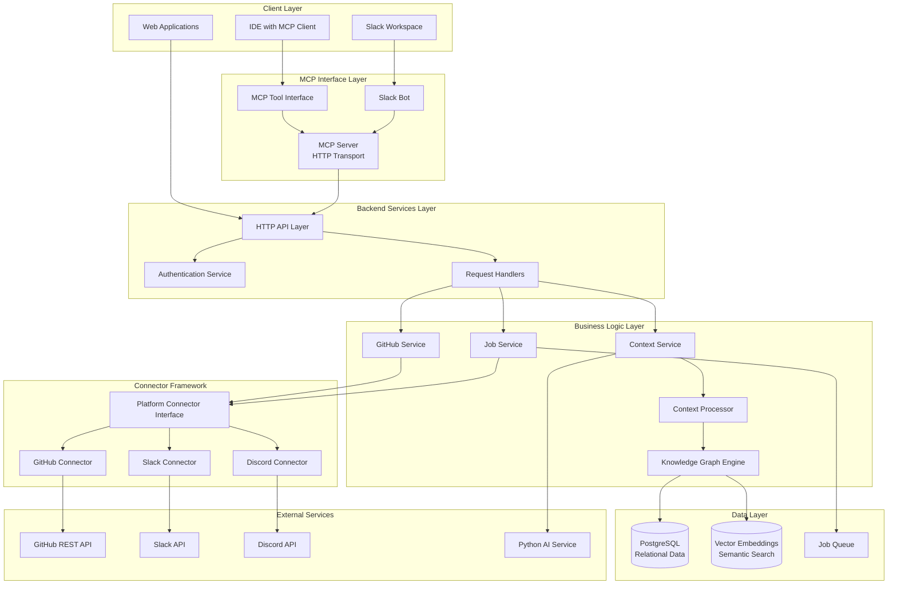

# Combined ContextKeeper Design Document

## Overview

The ContextKeeper system is a comprehensive, multi-platform developer context aggregation and retrieval engine that transforms hours of manual context hunting into seconds of AI-powered assistance. The system integrates three major components:

1. **ContextKeeper Go Backend**: A lightweight, standards-compliant HTTP service built exclusively with Go's standard library that orchestrates GitHub repository data ingestion, storage, and AI-powered context queries
2. **ContextKeeper MCP + Slack Bot**: A two-component architecture providing AI-powered repository context through an MCP server and Slack bot integration
3. **MCP Context Engine**: An advanced multi-platform knowledge aggregation system with pluggable connectors for GitHub, Slack, and Discord, intelligent context processing, and comprehensive MCP tool interfaces

The architecture follows clean separation of concerns with clear boundaries between HTTP handlers, business logic, data access layers, and external integrations. The system operates as a stateless service coordinating between external platforms (GitHub, Slack, Discord), PostgreSQL for normalized storage, and AI services for context processing.

## Architecture

### High-Level System Architecture




### Key Architectural Principles

1. **Backward Compatibility**: All existing APIs and data models remain unchanged during evolution
2. **Standard Library First**: Go backend uses only standard library packages for simplicity
3. **Pluggable Connectors**: New platforms can be added without modifying core system
4. **Fail-Fast Design**: Immediate error responses without complex retry mechanisms
5. **Sequential Processing**: Simple goroutine-based background jobs without persistent queues
6. **Stateless Design**: No in-memory caching or session state
7. **Normalized Storage**: Relational schema for efficient queries and data integrity
8. **Event-Driven Processing**: Asynchronous ingestion with background job processing
9. **Hybrid Storage**: PostgreSQL for structured data, vector embeddings for semantic search
10. **MCP Compliance**: Standard JSON-RPC 2.0 interface for tool integration

### Service Layer Architecture

The system follows a layered architecture pattern:

1. **MCP Tool Interface Layer**: Exposes MCP-compatible tools for IDE and AI assistant integration
2. **HTTP Layer**: Request routing, middleware, and response handling
3. **Service Layer**: Business logic and orchestration
4. **Connector Framework**: Pluggable platform integrations with common interface
5. **Context Processing Layer**: AI-powered knowledge extraction and relationship building
6. **Repository Layer**: Data access and persistence
7. **External Integration Layer**: GitHub API, Slack API, Discord API, and AI service clients

## Components and Interfaces

### HTTP Server Component

**Responsibilities:**
- Route HTTP requests to appropriate handlers
- Apply authentication middleware
- Handle CORS and basic security headers
- Manage request timeouts and graceful shutdown

**Key Interfaces:**
```go
type Server struct {
    router   *http.ServeMux
    authSvc  AuthService
    repoSvc  RepositoryService
    jobSvc   JobService
    ctxSvc   ContextService
}

type Handler interface {
    ServeHTTP(w http.ResponseWriter, r *http.Request)
}
```

### Authentication Service

**Responsibilities:**
- Handle GitHub OAuth flow
- Generate and validate JWT tokens
- Extract user information from tokens
- Manage multi-platform authentication

**Key Interfaces:**
```go
type AuthService interface {
    HandleGitHubCallback(code string) (*AuthResponse, error)
    ValidateJWT(token string) (*UserClaims, error)
    GenerateJWT(userID string, githubToken string) (string, error)
}

type UserClaims struct {
    UserID      string
    GitHubToken string
    ExpiresAt   int64
}
```

### Platform Connector Interface

The core abstraction for all platform integrations:

```go
type PlatformConnector interface {
    // Authenticate handles platform-specific OAuth flows
    Authenticate(ctx context.Context, config AuthConfig) (*AuthResult, error)
    
    // FetchEvents retrieves new events since last sync
    FetchEvents(ctx context.Context, since time.Time, limit int) ([]PlatformEvent, error)
    
    // NormalizeData converts platform events to common format
    NormalizeData(ctx context.Context, events []PlatformEvent) ([]NormalizedEvent, error)
    
    // ScheduleSync determines next sync interval based on platform limits
    ScheduleSync(ctx context.Context, lastSync time.Time) (time.Duration, error)
    
    // GetPlatformInfo returns connector metadata
    GetPlatformInfo() PlatformInfo
}

type PlatformEvent struct {
    ID          string                 `json:"id"`
    Type        EventType             `json:"type"`
    Timestamp   time.Time             `json:"timestamp"`
    Author      string                `json:"author"`
    Content     string                `json:"content"`
    Metadata    map[string]interface{} `json:"metadata"`
    References  []string              `json:"references"`
}

type NormalizedEvent struct {
    PlatformID   string                 `json:"platform_id"`
    EventType    EventType             `json:"event_type"`
    Timestamp    time.Time             `json:"timestamp"`
    Author       string                `json:"author"`
    Content      string                `json:"content"`
    ThreadID     *string               `json:"thread_id,omitempty"`
    ParentID     *string               `json:"parent_id,omitempty"`
    FileRefs     []string              `json:"file_refs"`
    FeatureRefs  []string              `json:"feature_refs"`
    Metadata     map[string]interface{} `json:"metadata"`
}
```

### GitHub Connector (Refactored)

Adapts existing GitHub service to the connector interface:

```go
type GitHubConnector struct {
    client     *GitHubService
    rateLimiter *RateLimiter
    config     *GitHubConfig
}

func (g *GitHubConnector) FetchEvents(ctx context.Context, since time.Time, limit int) ([]PlatformEvent, error) {
    // Leverage existing GitHub service methods
    prs, _ := g.client.GetPullRequests(ctx, token, owner, repo, 50)
    issues, _ := g.client.GetIssues(ctx, token, owner, repo, 50)
    commits, _ := g.client.GetCommits(ctx, token, owner, repo, 100)
    
    // Convert to PlatformEvent format
    return g.convertToEvents(prs, issues, commits), nil
}
```

### GitHub Service

**Responsibilities:**
- Authenticate with GitHub API using user tokens
- Fetch repository metadata with rate limiting
- Handle GitHub API errors and pagination

**Key Interfaces:**
```go
type GitHubService interface {
    GetUserRepos(token string) ([]Repository, error)
    GetPullRequests(token, owner, repo string, limit int) ([]PullRequest, error)
    GetIssues(token, owner, repo string, limit int) ([]Issue, error)
    GetCommits(token, owner, repo string, limit int) ([]Commit, error)
}

type GitHubClient struct {
    httpClient *http.Client
    baseURL    string
}
```

### Slack Connector

New connector for Slack integration:

```go
type SlackConnector struct {
    client      *slack.Client
    rateLimiter *RateLimiter
    config      *SlackConfig
}

type SlackConfig struct {
    BotToken     string   `json:"bot_token"`
    Channels     []string `json:"channels"`
    IncludeDMs   bool     `json:"include_dms"`
    ThreadDepth  int      `json:"thread_depth"`
}

func (s *SlackConnector) FetchEvents(ctx context.Context, since time.Time, limit int) ([]PlatformEvent, error) {
    var events []PlatformEvent
    
    for _, channel := range s.config.Channels {
        messages, err := s.client.GetConversationHistory(&slack.GetConversationHistoryParameters{
            ChannelID: channel,
            Oldest:    fmt.Sprintf("%.6f", float64(since.Unix())),
            Limit:     limit,
        })
        if err != nil {
            return nil, fmt.Errorf("failed to fetch Slack messages: %w", err)
        }
        
        for _, msg := range messages.Messages {
            event := s.convertMessageToEvent(msg, channel)
            events = append(events, event)
            
            // Fetch thread replies if message has replies
            if msg.ReplyCount > 0 {
                replies, _ := s.fetchThreadReplies(channel, msg.Timestamp)
                events = append(events, replies...)
            }
        }
    }
    
    return events, nil
}
```

### Discord Connector

New connector for Discord integration:

```go
type DiscordConnector struct {
    session     *discordgo.Session
    rateLimiter *RateLimiter
    config      *DiscordConfig
}

type DiscordConfig struct {
    BotToken    string   `json:"bot_token"`
    GuildIDs    []string `json:"guild_ids"`
    ChannelIDs  []string `json:"channel_ids"`
    ThreadDepth int      `json:"thread_depth"`
}

func (d *DiscordConnector) FetchEvents(ctx context.Context, since time.Time, limit int) ([]PlatformEvent, error) {
    var events []PlatformEvent
    
    for _, channelID := range d.config.ChannelIDs {
        messages, err := d.session.ChannelMessages(channelID, limit, "", "", "")
        if err != nil {
            return nil, fmt.Errorf("failed to fetch Discord messages: %w", err)
        }
        
        for _, msg := range messages {
            if msg.Timestamp.After(since) {
                event := d.convertMessageToEvent(msg)
                events = append(events, event)
            }
        }
    }
    
    return events, nil
}
```

### Job Service

**Responsibilities:**
- Create and manage ingestion jobs
- Coordinate background processing
- Track job status and errors

**Key Interfaces:**
```go
type JobService interface {
    CreateIngestionJob(repoID int64, userID string) (*IngestionJob, error)
    GetJobStatus(jobID int64) (*IngestionJob, error)
    ProcessJob(job *IngestionJob) error
}

type IngestionJob struct {
    ID         int64
    RepoID     int64
    Status     JobStatus
    StartedAt  *time.Time
    FinishedAt *time.Time
    ErrorMsg   *string
}
```

### Context Service

**Responsibilities:**
- Filter repository data for AI service
- Coordinate with Python AI service
- Handle AI service timeouts and errors

**Key Interfaces:**
```go
type ContextService interface {
    ProcessQuery(repoID int64, query string) (*ContextResponse, error)
    FilterRepoData(repoID int64) (*FilteredRepoData, error)
}

type FilteredRepoData struct {
    PullRequests []PullRequest `json:"pull_requests"`
    Issues       []Issue       `json:"issues"`
    Commits      []Commit      `json:"commits"`
}
```

### Context Processing Engine

Transforms raw platform events into structured knowledge:

```go
type ContextProcessor struct {
    aiService    AIService
    knowledgeGraph *KnowledgeGraph
    embeddings   *EmbeddingService
}

type ProcessingResult struct {
    DecisionRecords    []DecisionRecord    `json:"decision_records"`
    DiscussionSummaries []DiscussionSummary `json:"discussion_summaries"`
    FeatureContexts    []FeatureContext    `json:"feature_contexts"`
    FileContexts       []FileContextHistory `json:"file_contexts"`
    Relationships      []Relationship      `json:"relationships"`
}

func (cp *ContextProcessor) ProcessEvents(ctx context.Context, events []NormalizedEvent) (*ProcessingResult, error) {
    result := &ProcessingResult{}
    
    // Group related events (threads, file references, etc.)
    eventGroups := cp.groupRelatedEvents(events)
    
    for _, group := range eventGroups {
        // Extract decisions from discussions
        decisions := cp.extractDecisions(ctx, group)
        result.DecisionRecords = append(result.DecisionRecords, decisions...)
        
        // Generate discussion summaries
        summaries := cp.generateSummaries(ctx, group)
        result.DiscussionSummaries = append(result.DiscussionSummaries, summaries...)
        
        // Build feature contexts
        features := cp.buildFeatureContexts(ctx, group)
        result.FeatureContexts = append(result.FeatureContexts, features...)
        
        // Track file contexts
        fileContexts := cp.buildFileContexts(ctx, group)
        result.FileContexts = append(result.FileContexts, fileContexts...)
        
        // Extract relationships
        relationships := cp.extractRelationships(ctx, group)
        result.Relationships = append(result.Relationships, relationships...)
    }
    
    return result, nil
}
```

### Knowledge Graph Layer

Extends the existing PostgreSQL schema with relationship tracking:

```go
type KnowledgeGraph struct {
    db         *sql.DB
    embeddings *EmbeddingService
}

type KnowledgeGraphService interface {
    StoreEntity(ctx context.Context, entity *KnowledgeEntity) error
    CreateRelationship(ctx context.Context, rel *KnowledgeRelationship) error
    TraverseGraph(ctx context.Context, startEntityID int64, depth int) ([]KnowledgeEntity, error)
    SemanticSearch(ctx context.Context, query string, limit int) ([]KnowledgeEntity, error)
}
```

### MCP Server Component

**Core Interface**:
```typescript
interface MCPServer {
  start(port: number): Promise<void>
  stop(): Promise<void>
  handleRequest(request: MCPRequest): Promise<MCPResponse>
}

interface MCPRequest {
  method: string
  params: Record<string, any>
}

interface MCPResponse {
  result?: any
  error?: MCPError
}
```

**Resource Providers**:
```typescript
interface ResourceProvider {
  listResources(): Promise<Resource[]>
  getResource(uri: string): Promise<ResourceContent>
}

interface Resource {
  uri: string
  name: string
  description: string
  mimeType: string
}
```

**Tool Implementations**:
```typescript
interface ToolProvider {
  listTools(): Promise<Tool[]>
  callTool(name: string, arguments: Record<string, any>): Promise<ToolResult>
}

interface Tool {
  name: string
  description: string
  inputSchema: JSONSchema
}
```

### MCP Tool Interface

Implements the MCP specification for tool exposure:

```go
type MCPToolServer struct {
    contextService *ContextService
    knowledgeGraph *KnowledgeGraph
    authService    *AuthService
}

type MCPTool struct {
    Name        string      `json:"name"`
    Description string      `json:"description"`
    InputSchema interface{} `json:"inputSchema"`
}

func (m *MCPToolServer) ListTools(ctx context.Context) ([]MCPTool, error) {
    return []MCPTool{
        {
            Name:        "search_project_knowledge",
            Description: "Search across all project knowledge including discussions, decisions, and context",
            InputSchema: map[string]interface{}{
                "type": "object",
                "properties": map[string]interface{}{
                    "query": map[string]interface{}{
                        "type":        "string",
                        "description": "Search query for project knowledge",
                    },
                    "platforms": map[string]interface{}{
                        "type":        "array",
                        "items":       map[string]string{"type": "string"},
                        "description": "Filter by specific platforms (github, slack, discord)",
                    },
                    "limit": map[string]interface{}{
                        "type":        "integer",
                        "description": "Maximum number of results to return",
                        "default":     10,
                    },
                },
                "required": []string{"query"},
            },
        },
        {
            Name:        "get_context_for_file",
            Description: "Get comprehensive context for a specific file including change history and discussions",
            InputSchema: map[string]interface{}{
                "type": "object",
                "properties": map[string]interface{}{
                    "file_path": map[string]interface{}{
                        "type":        "string",
                        "description": "Path to the file relative to repository root",
                    },
                    "include_history": map[string]interface{}{
                        "type":        "boolean",
                        "description": "Include change history and related PRs",
                        "default":     true,
                    },
                },
                "required": []string{"file_path"},
            },
        },
        {
            Name:        "get_decision_history",
            Description: "Get decision history for a feature or file",
            InputSchema: map[string]interface{}{
                "type": "object",
                "properties": map[string]interface{}{
                    "feature_or_file": map[string]interface{}{
                        "type":        "string",
                        "description": "Feature name or file path",
                    },
                },
                "required": []string{"feature_or_file"},
            },
        },
        {
            Name:        "list_recent_architecture_discussions",
            Description: "List recent architectural discussions",
            InputSchema: map[string]interface{}{
                "type": "object",
                "properties": map[string]interface{}{
                    "days": map[string]interface{}{
                        "type":        "integer",
                        "description": "Number of days to look back",
                        "default":     30,
                    },
                },
            },
        },
        {
            Name:        "explain_why_code_exists",
            Description: "Explain why specific code exists",
            InputSchema: map[string]interface{}{
                "type": "object",
                "properties": map[string]interface{}{
                    "file_path": map[string]interface{}{
                        "type":        "string",
                        "description": "Path to the file",
                    },
                },
                "required": []string{"file_path"},
            },
        },
        {
            Name:        "query_repository_context",
            Description: "Query repository for specific context information",
            InputSchema: map[string]interface{}{
                "type": "object",
                "properties": map[string]interface{}{
                    "query": map[string]interface{}{
                        "type":        "string",
                        "description": "Natural language query",
                    },
                    "repositoryId": map[string]interface{}{
                        "type":        "string",
                        "description": "Optional repository ID",
                    },
                    "limit": map[string]interface{}{
                        "type":        "integer",
                        "description": "Maximum results",
                        "default":     10,
                    },
                },
                "required": []string{"query"},
            },
        },
        {
            Name:        "get_onboarding_summary",
            Description: "Generate onboarding summary for new team members",
            InputSchema: map[string]interface{}{
                "type": "object",
                "properties": map[string]interface{}{
                    "repositoryId": map[string]interface{}{
                        "type":        "string",
                        "description": "Repository ID",
                    },
                    "focusAreas": map[string]interface{}{
                        "type":        "array",
                        "items":       map[string]string{"type": "string"},
                        "description": "Optional focus areas for onboarding",
                    },
                },
                "required": []string{"repositoryId"},
            },
        },
    }, nil
}

func (m *MCPToolServer) CallTool(ctx context.Context, name string, arguments map[string]interface{}) (*MCPToolResult, error) {
    switch name {
    case "search_project_knowledge":
        return m.searchProjectKnowledge(ctx, arguments)
    case "get_context_for_file":
        return m.getContextForFile(ctx, arguments)
    case "get_decision_history":
        return m.getDecisionHistory(ctx, arguments)
    case "list_recent_architecture_discussions":
        return m.listRecentArchitectureDiscussions(ctx, arguments)
    case "explain_why_code_exists":
        return m.explainWhyCodeExists(ctx, arguments)
    case "query_repository_context":
        return m.queryRepositoryContext(ctx, arguments)
    case "get_onboarding_summary":
        return m.getOnboardingSummary(ctx, arguments)
    default:
        return nil, fmt.Errorf("unknown tool: %s", name)
    }
}
```

### Slack Bot Component

**Command Handler Interface**:
```typescript
interface SlackBot {
  start(): Promise<void>
  stop(): Promise<void>
  handleCommand(command: SlackCommand): Promise<SlackResponse>
}

interface SlackCommand {
  command: string
  text: string
  userId: string
  channelId: string
}

interface SlackResponse {
  text: string
  blocks?: SlackBlock[]
  responseType: 'ephemeral' | 'in_channel'
}
```

**MCP Client Interface**:
```typescript
interface MCPClient {
  queryContext(query: string, repositoryId?: string): Promise<string>
  getOnboardingSummary(repositoryId: string): Promise<string>
  getRecentActivity(repositoryId: string, days?: number): Promise<string>
  getSystemStatus(): Promise<SystemStatus>
}
```

### Repository Layer

**Responsibilities:**
- Database connection management
- CRUD operations for all entities
- Transaction management
- Query optimization

**Key Interfaces:**
```go
type RepositoryStore interface {
    CreateRepo(repo *Repository) error
    GetReposByUser(userID string) ([]Repository, error)
    CreatePullRequest(pr *PullRequest) error
    CreateIssue(issue *Issue) error
    CreateCommit(commit *Commit) error
    GetRecentPRs(repoID int64, limit int) ([]PullRequest, error)
    GetRecentIssues(repoID int64, limit int) ([]Issue, error)
    GetRecentCommits(repoID int64, limit int) ([]Commit, error)
}
```


## Data Models

### Core Entities

**Repository**
```go
type Repository struct {
    ID        int64     `json:"id"`
    Name      string    `json:"name"`
    FullName  string    `json:"full_name"`
    Owner     string    `json:"owner"`
    CreatedAt time.Time `json:"created_at"`
    UpdatedAt time.Time `json:"updated_at"`
}
```

**Pull Request**
```go
type PullRequest struct {
    ID           int64     `json:"id"`
    RepoID       int64     `json:"repo_id"`
    Number       int       `json:"number"`
    Title        string    `json:"title"`
    Body         string    `json:"body"`
    Author       string    `json:"author"`
    State        string    `json:"state"`
    CreatedAt    time.Time `json:"created_at"`
    MergedAt     *time.Time `json:"merged_at"`
    FilesChanged []string  `json:"files_changed"`
    Labels       []string  `json:"labels"`
}
```

**Issue**
```go
type Issue struct {
    ID        int64     `json:"id"`
    RepoID    int64     `json:"repo_id"`
    Title     string    `json:"title"`
    Body      string    `json:"body"`
    Author    string    `json:"author"`
    State     string    `json:"state"`
    CreatedAt time.Time `json:"created_at"`
    ClosedAt  *time.Time `json:"closed_at"`
    Labels    []string  `json:"labels"`
}
```

**Commit**
```go
type Commit struct {
    SHA          string    `json:"sha"`
    RepoID       int64     `json:"repo_id"`
    Message      string    `json:"message"`
    Author       string    `json:"author"`
    CreatedAt    time.Time `json:"created_at"`
    FilesChanged []string  `json:"files_changed"`
}
```

**Ingestion Job**
```go
type IngestionJob struct {
    ID         int64      `json:"id"`
    RepoID     int64      `json:"repo_id"`
    Status     JobStatus  `json:"status"`
    StartedAt  *time.Time `json:"started_at"`
    FinishedAt *time.Time `json:"finished_at"`
    ErrorMsg   *string    `json:"error_message"`
}

type JobStatus string

const (
    JobStatusPending   JobStatus = "pending"
    JobStatusRunning   JobStatus = "running"
    JobStatusCompleted JobStatus = "completed"
    JobStatusPartial   JobStatus = "partial"
    JobStatusFailed    JobStatus = "failed"
)
```

### Extended Knowledge Graph Models

```go
// New knowledge graph models
type KnowledgeEntity struct {
    ID          int64                  `json:"id"`
    Type        EntityType            `json:"type"`
    Name        string                `json:"name"`
    Description string                `json:"description"`
    Metadata    map[string]interface{} `json:"metadata"`
    Embedding   []float32             `json:"-"` // Vector embedding for semantic search
    CreatedAt   time.Time             `json:"created_at"`
    UpdatedAt   time.Time             `json:"updated_at"`
}

type EntityType string

const (
    EntityTypeFeature     EntityType = "feature"
    EntityTypeFile        EntityType = "file"
    EntityTypeDecision    EntityType = "decision"
    EntityTypeDiscussion  EntityType = "discussion"
    EntityTypeContributor EntityType = "contributor"
)

type KnowledgeRelationship struct {
    ID               int64                  `json:"id"`
    SourceEntityID   int64                 `json:"source_entity_id"`
    TargetEntityID   int64                 `json:"target_entity_id"`
    RelationshipType RelationshipType      `json:"relationship_type"`
    Strength         float64               `json:"strength"`
    Metadata         map[string]interface{} `json:"metadata"`
    CreatedAt        time.Time             `json:"created_at"`
}

type RelationshipType string

const (
    RelationshipRelatesTo    RelationshipType = "relates_to"
    RelationshipIntroducedBy RelationshipType = "introduced_by"
    RelationshipModifiedBy   RelationshipType = "modified_by"
    RelationshipDiscussedIn  RelationshipType = "discussed_in"
)

type DecisionRecord struct {
    ID             int64     `json:"id"`
    EntityID       int64     `json:"entity_id"`
    Title          string    `json:"title"`
    Decision       string    `json:"decision"`
    Rationale      string    `json:"rationale"`
    Alternatives   []string  `json:"alternatives"`
    Consequences   []string  `json:"consequences"`
    Status         string    `json:"status"`
    PlatformSource string    `json:"platform_source"`
    SourceEventIDs []string  `json:"source_event_ids"`
    CreatedAt      time.Time `json:"created_at"`
}

type DiscussionSummary struct {
    ID                int64     `json:"id"`
    EntityID          int64     `json:"entity_id"`
    ThreadID          string    `json:"thread_id"`
    Platform          string    `json:"platform"`
    Participants      []string  `json:"participants"`
    Summary           string    `json:"summary"`
    KeyPoints         []string  `json:"key_points"`
    ActionItems       []string  `json:"action_items"`
    FileReferences    []string  `json:"file_references"`
    FeatureReferences []string  `json:"feature_references"`
    CreatedAt         time.Time `json:"created_at"`
}

type FileContextHistory struct {
    ID                int64                  `json:"id"`
    EntityID          int64                 `json:"entity_id"`
    FilePath          string                `json:"file_path"`
    ChangeReason      string                `json:"change_reason"`
    DiscussionContext string                `json:"discussion_context"`
    RelatedDecisions  []int64               `json:"related_decisions"`
    Contributors      []string              `json:"contributors"`
    PlatformSources   map[string]interface{} `json:"platform_sources"`
    CreatedAt         time.Time             `json:"created_at"`
}
```

### MCP Protocol Models

**MCP Resources**:
```typescript
interface RepositoryResource {
  uri: string // "contextkeeper://repository/{id}"
  name: string // Repository name
  description: string // Repository description
  mimeType: "application/json"
  content: RepositoryMetadata
}

interface ContextResource {
  uri: string // "contextkeeper://context/{id}"
  name: string // "Repository Context"
  description: string // Context description
  mimeType: "text/plain"
  content: string // Formatted context text
}

interface TimelineResource {
  uri: string // "contextkeeper://timeline/{id}"
  name: string // "Repository Timeline"
  description: string // Timeline description
  mimeType: "application/json"
  content: TimelineEvent[]
}
```

**MCP Tool Response Models**:
```go
type MCPToolResult struct {
    Content []MCPContent `json:"content"`
    IsError bool         `json:"isError,omitempty"`
}

type MCPContent struct {
    Type string      `json:"type"`
    Text string      `json:"text,omitempty"`
    Data interface{} `json:"data,omitempty"`
}
```

### Slack Bot Models

**Command Models**:
```typescript
interface ContextCommand {
  command: "/context"
  parameters: {
    query: string
    repository?: string
  }
}

interface OnboardCommand {
  command: "/onboard"
  parameters: {
    repository?: string
    focus?: string[]
  }
}

interface RecentCommand {
  command: "/recent"
  parameters: {
    repository?: string
    days?: number
  }
}

interface StatusCommand {
  command: "/status"
  parameters: {}
}
```

**Response Models**:
```typescript
interface SlackContextResponse {
  text: string
  blocks: [
    {
      type: "section"
      text: {
        type: "mrkdwn"
        text: string // Formatted context response
      }
    },
    {
      type: "context"
      elements: [
        {
          type: "mrkdwn"
          text: string // Metadata (repository, query time, etc.)
        }
      ]
    }
  ]
  responseType: "ephemeral"
}
```

### Repository Data Models

**Repository Metadata** (from Go Backend):
```typescript
interface RepositoryMetadata {
  id: string
  name: string
  fullName: string
  description: string
  url: string
  defaultBranch: string
  language: string
  topics: string[]
  createdAt: string
  updatedAt: string
  lastIngestionAt: string
  status: "active" | "ingesting" | "error"
}

interface Label {
  name: string
  color: string
  description: string
}
```

### Configuration Models

**MCP Server Configuration**:
```typescript
interface MCPServerConfig {
  port: number
  goBackendUrl: string
  corsOrigins: string[]
  logLevel: "debug" | "info" | "warn" | "error"
  timeout: number // Request timeout in milliseconds
}
```

**Slack Bot Configuration**:
```typescript
interface SlackBotConfig {
  botToken: string
  signingSecret: string
  mcpServerUrl: string
  port: number
  defaultRepository?: string
  maxResponseLength: number
  retryAttempts: number
  retryDelay: number
}
```

**System Configuration**:
```typescript
interface SystemConfig {
  mcp: MCPServerConfig
  slack: SlackBotConfig
  demo: {
    sampleRepositoryId: string
    predictableResponses: boolean
    demoMode: boolean
  }
}
```

### Database Schema

**Core Tables:**

```sql
-- Repositories table
CREATE TABLE repos (
    id BIGSERIAL PRIMARY KEY,
    name VARCHAR(255) NOT NULL,
    full_name VARCHAR(255) NOT NULL UNIQUE,
    owner VARCHAR(255) NOT NULL,
    created_at TIMESTAMP WITH TIME ZONE DEFAULT NOW(),
    updated_at TIMESTAMP WITH TIME ZONE DEFAULT NOW()
);

-- Pull requests table
CREATE TABLE pull_requests (
    id BIGINT PRIMARY KEY,
    repo_id BIGINT NOT NULL REFERENCES repos(id) ON DELETE CASCADE,
    number INTEGER NOT NULL,
    title TEXT NOT NULL,
    body TEXT,
    author VARCHAR(255) NOT NULL,
    state VARCHAR(50) NOT NULL,
    created_at TIMESTAMP WITH TIME ZONE NOT NULL,
    merged_at TIMESTAMP WITH TIME ZONE,
    files_changed JSONB,
    labels JSONB,
    UNIQUE(repo_id, number)
);

-- Issues table
CREATE TABLE issues (
    id BIGINT PRIMARY KEY,
    repo_id BIGINT NOT NULL REFERENCES repos(id) ON DELETE CASCADE,
    title TEXT NOT NULL,
    body TEXT,
    author VARCHAR(255) NOT NULL,
    state VARCHAR(50) NOT NULL,
    created_at TIMESTAMP WITH TIME ZONE NOT NULL,
    closed_at TIMESTAMP WITH TIME ZONE,
    labels JSONB
);

-- Commits table
CREATE TABLE commits (
    sha VARCHAR(40) PRIMARY KEY,
    repo_id BIGINT NOT NULL REFERENCES repos(id) ON DELETE CASCADE,
    message TEXT NOT NULL,
    author VARCHAR(255) NOT NULL,
    created_at TIMESTAMP WITH TIME ZONE NOT NULL,
    files_changed JSONB
);

-- Ingestion jobs table
CREATE TABLE ingestion_jobs (
    id BIGSERIAL PRIMARY KEY,
    repo_id BIGINT NOT NULL REFERENCES repos(id) ON DELETE CASCADE,
    status VARCHAR(50) NOT NULL DEFAULT 'pending',
    started_at TIMESTAMP WITH TIME ZONE,
    finished_at TIMESTAMP WITH TIME ZONE,
    error_message TEXT
);

-- Indexes for performance
CREATE INDEX idx_repos_owner ON repos(owner);
CREATE INDEX idx_pull_requests_repo_created ON pull_requests(repo_id, created_at DESC);
CREATE INDEX idx_pull_requests_repo_author ON pull_requests(repo_id, author);
CREATE INDEX idx_issues_repo_created ON issues(repo_id, created_at DESC);
CREATE INDEX idx_issues_repo_author ON issues(repo_id, author);
CREATE INDEX idx_commits_repo_created ON commits(repo_id, created_at DESC);
CREATE INDEX idx_commits_repo_author ON commits(repo_id, author);
CREATE INDEX idx_ingestion_jobs_repo ON ingestion_jobs(repo_id);
```

**Knowledge Graph Tables:**

```sql
-- New tables for knowledge graph
CREATE TABLE knowledge_entities (
    id SERIAL PRIMARY KEY,
    type VARCHAR(50) NOT NULL, -- 'feature', 'file', 'decision', 'discussion', 'contributor'
    name VARCHAR(255) NOT NULL,
    description TEXT,
    metadata JSONB,
    embedding VECTOR(1536), -- For semantic search
    created_at TIMESTAMP DEFAULT NOW(),
    updated_at TIMESTAMP DEFAULT NOW()
);

CREATE TABLE knowledge_relationships (
    id SERIAL PRIMARY KEY,
    source_entity_id INTEGER REFERENCES knowledge_entities(id),
    target_entity_id INTEGER REFERENCES knowledge_entities(id),
    relationship_type VARCHAR(50) NOT NULL, -- 'relates_to', 'introduced_by', 'modified_by', 'discussed_in'
    strength FLOAT DEFAULT 1.0, -- Relationship strength for ranking
    metadata JSONB,
    created_at TIMESTAMP DEFAULT NOW()
);

CREATE TABLE decision_records (
    id SERIAL PRIMARY KEY,
    entity_id INTEGER REFERENCES knowledge_entities(id),
    title VARCHAR(255) NOT NULL,
    decision TEXT NOT NULL,
    rationale TEXT,
    alternatives TEXT[],
    consequences TEXT[],
    status VARCHAR(50) DEFAULT 'active', -- 'active', 'superseded', 'deprecated'
    platform_source VARCHAR(50) NOT NULL,
    source_event_ids TEXT[],
    created_at TIMESTAMP DEFAULT NOW()
);

CREATE TABLE discussion_summaries (
    id SERIAL PRIMARY KEY,
    entity_id INTEGER REFERENCES knowledge_entities(id),
    thread_id VARCHAR(255),
    platform VARCHAR(50) NOT NULL,
    participants TEXT[],
    summary TEXT NOT NULL,
    key_points TEXT[],
    action_items TEXT[],
    file_references TEXT[],
    feature_references TEXT[],
    created_at TIMESTAMP DEFAULT NOW()
);

CREATE TABLE file_context_history (
    id SERIAL PRIMARY KEY,
    entity_id INTEGER REFERENCES knowledge_entities(id),
    file_path VARCHAR(500) NOT NULL,
    change_reason TEXT,
    discussion_context TEXT,
    related_decisions INTEGER[] REFERENCES decision_records(id),
    contributors TEXT[],
    platform_sources JSONB, -- Track which platforms discussed this file
    created_at TIMESTAMP DEFAULT NOW()
);
```


## Correctness Properties

*A property is a characteristic or behavior that should hold true across all valid executions of a system—essentially, a formal statement about what the system should do. Properties serve as the bridge between human-readable specifications and machine-verifiable correctness guarantees.*

### Backend Core Properties

#### Property 1: OAuth Scope Consistency
*For any* GitHub OAuth request initiated by the system, the requested scopes should always include exactly: public_repo, read:user, user:email
**Validates: Requirements 1.1.1**

#### Property 2: JWT Authentication Round Trip
*For any* successful GitHub OAuth flow, generating a JWT token and then validating it should preserve the user identity and GitHub token information
**Validates: Requirements 1.1.3, 1.1.5**

#### Property 3: Repository Data Extraction Limits
*For any* repository ingestion operation, the system should extract at most 50 pull requests, 50 issues, and 100 commits, ordered by most recent timestamp, regardless of how many items exist in the repository
**Validates: Requirements 2.1.2, 2.1.3, 2.1.4, 11.1.1, 11.1.2, 11.1.3**

#### Property 4: Repository Metadata Field Extraction
*For any* repository data item, only the specified metadata fields should be extracted and stored: PRs (id, number, title, body, author, state, created_at, merged_at, files_changed, labels), Issues (id, title, body, author, state, created_at, closed_at, labels), Commits (sha, message, author, created_at, files_changed)
**Validates: Requirements 3.1.1, 3.1.2, 3.1.3**

#### Property 5: Structured Array Serialization
*For any* multi-valued metadata fields (files_changed, labels), the system should serialize them as valid JSONB arrays that can be round-trip deserialized to equivalent values
**Validates: Requirements 3.1.4, 3.1.5**

#### Property 6: Ingestion Job Lifecycle
*For any* ingestion job, status transitions should follow the valid sequence: pending → running → (completed|partial|failed), with appropriate timestamps and error messages persisted for each state change
**Validates: Requirements 4.1.1, 4.1.2, 4.1.3, 4.1.4, 4.1.5, 4.1.6**

#### Property 7: AI Context Payload Filtering
*For any* context query, the system should send exactly the most recent 10 pull requests, 10 issues, and 20 commits to the AI service, without performing semantic relevance filtering
**Validates: Requirements 6.1.1, 6.1.2, 6.1.3, 6.1.7, 11.1.4, 11.1.5, 11.1.6**

#### Property 8: AI Service Timeout Enforcement
*For any* AI service call, if the response takes longer than 30 seconds, the system should immediately return a timeout error without waiting further
**Validates: Requirements 6.1.4, 6.1.5**

#### Property 9: Backend API Authentication Enforcement
*For any* API endpoint request (except OAuth callback), the system should validate JWT authentication before processing and expose action-based REST endpoints with structured JSON responses
**Validates: Requirements 5.1.1, 5.1.2, 5.1.3, 5.1.4, 5.1.5, 5.1.6, 9.1.4**

#### Property 10: Fail-Fast Error Handling
*For any* error condition (external service failures, malformed requests, database failures), the system should return immediate error responses with appropriate HTTP status codes and descriptive messages, without background retries beyond a single attempt
**Validates: Requirements 2.1.6, 9.1.1, 9.1.2, 9.1.3, 9.1.4, 9.1.5**

### MCP Server and Slack Bot Properties

#### Property 11: MCP Server Port Binding
*For any* valid port configuration, starting the MCP server should result in the server successfully listening on that port and accepting connections
**Validates: Requirements 5.2.1**

#### Property 12: MCP Resource Response Completeness
*For any* valid repository resource request, the MCP server should return responses containing all required metadata fields (repository info, context data, and timeline information)
**Validates: Requirements 5.2.2**

#### Property 13: Go Backend API Integration
*For any* valid context query, the MCP server should make the correct REST API calls to the Go backend and return properly formatted responses
**Validates: Requirements 5.2.3**

#### Property 14: MCP Tool Implementation
*For any* valid tool request (query_repository_context or get_onboarding_summary), the MCP server should execute the tool and return results in the correct format
**Validates: Requirements 5.2.4, 5.2.5**

#### Property 15: Slack Command Processing
*For any* valid Slack command (/context, /onboard, /recent, /status), the Slack bot should query the MCP server and return appropriately formatted responses
**Validates: Requirements 5.4.1, 5.4.2, 5.4.3, 5.4.4**

#### Property 16: Error Message Formatting
*For any* error condition (backend unavailable, MCP errors, invalid inputs), the system should return user-friendly error messages appropriate for the interface (Slack or MCP)
**Validates: Requirements 5.2.6, 5.4.5, 9.2.1, 9.2.4**

#### Property 17: Repository Metadata Completeness
*For any* repository metadata query, the system should return complete information including all required fields for PRs, issues, and commits (titles, bodies, labels, timestamps, file changes)
**Validates: Requirements 7.1.1, 7.1.2, 7.1.3**

#### Property 18: Timeline Chronological Ordering
*For any* timeline request, the system should return repository activity sorted in chronological order from most recent to oldest
**Validates: Requirements 7.1.4**

#### Property 19: Onboarding Summary Content
*For any* valid repository, onboarding summaries should include repository purpose, recent changes, and contributor information when available
**Validates: Requirements 7.2.1, 7.2.2, 7.2.3**

#### Property 20: Configuration Validation
*For any* system configuration (MCP server or Slack bot), the system should validate all required parameters and provide clear error messages for missing or invalid values
**Validates: Requirements 13.1.1, 13.1.2, 13.1.3, 13.1.4**

#### Property 21: Graceful Restart Behavior
*For any* configuration change, the system should restart without losing existing data or connections
**Validates: Requirements 13.1.6**

#### Property 22: Retry Mechanism with Exponential Backoff
*For any* failed Slack API call, the Slack bot should retry with exponential backoff up to the configured maximum attempts
**Validates: Requirements 9.2.2**

#### Property 23: Timeout Handling
*For any* MCP query that exceeds the timeout threshold, the system should return timeout messages with suggested retry actions
**Validates: Requirements 9.2.3**

#### Property 24: Secure Logging
*For any* error or system event, logs should contain appropriate debugging information without exposing sensitive data (tokens, credentials, personal information)
**Validates: Requirements 9.2.5**

#### Property 25: Partial Data Handling
*For any* query where only partial repository data is available, the system should return available information with clear warnings about missing data
**Validates: Requirements 9.2.6**

#### Property 26: MCP Protocol Compliance
*For any* MCP request, the server should respond according to the MCP HTTP transport protocol specification, including proper resource descriptors, tool schemas, and error handling
**Validates: Requirements 14.1.1, 14.1.2, 14.1.3, 14.1.4, 14.1.5, 14.1.6**

#### Property 27: Demo Mode Predictability
*For any* demo mode execution, the system should use consistent sample data and provide predictable responses for demonstration purposes
**Validates: Requirements 12.1.3**

#### Property 28: Demo Fallback Handling
*For any* demo component failure, the system should provide clear fallback options to continue the demonstration
**Validates: Requirements 12.1.6**

### MCP Context Engine Properties

#### Property 29: Platform Connector Interface Compliance
*For any* platform connector implementation, all required interface methods (Authenticate, FetchEvents, NormalizeData, ScheduleSync) should be present and return the correct types
**Validates: Requirements 2.2.1, 2.3.6, 2.4.1, 2.5.1**

#### Property 30: Connector Isolation and Extensibility
*For any* combination of enabled platform connectors, adding or removing a connector should not affect the operation of other connectors
**Validates: Requirements 2.2.2, 13.2.3**

#### Property 31: Incremental Synchronization Consistency
*For any* platform connector and timestamp, running incremental sync multiple times with the same timestamp should not create duplicate events
**Validates: Requirements 2.2.3, 2.4.6, 2.5.6**

#### Property 32: Rate Limiting Compliance
*For any* platform connector encountering rate limits, the connector should implement exponential backoff and respect platform-specific rate limits
**Validates: Requirements 2.2.4, 2.4.5, 2.5.5**

#### Property 33: Data Normalization Consistency
*For any* platform-specific event, the normalized output should conform to the common NormalizedEvent structure with all required fields populated
**Validates: Requirements 2.2.5, 2.4.7, 2.5.7**

#### Property 34: OAuth Authentication Security
*For any* platform requiring OAuth authentication, token management should be secure and OAuth flows should complete successfully with appropriate scopes
**Validates: Requirements 1.2.1, 1.2.2, 1.2.3**

#### Property 35: GitHub Backward Compatibility
*For any* existing GitHub API endpoint or authentication flow, the behavior should remain identical to the current system
**Validates: Requirements 2.3.1, 2.3.2, 2.3.5, 15.1.1, 15.1.2, 15.1.3, 15.1.5, 15.1.6**

#### Property 36: GitHub Data Extraction Preservation
*For any* GitHub pull request, file-level change context should be extracted and JSONB serialization should work correctly for files_changed and labels fields
**Validates: Requirements 2.3.3, 2.3.4**

#### Property 37: Thread Context Preservation
*For any* threaded conversation from Slack or Discord, parent-child relationships and thread context should be preserved in the normalized data
**Validates: Requirements 2.4.3, 2.5.3**

#### Property 38: Cross-Platform Decision Extraction
*For any* discussion thread containing engineering decisions, the Context_Processor should extract Decision_Record objects regardless of the source platform
**Validates: Requirements 2.4.4, 2.5.4, 3.2.1**

#### Property 39: Relationship Identification Accuracy
*For any* set of processed events, the Context_Processor should correctly identify relationships between files, features, and contributors
**Validates: Requirements 3.2.2, 3.2.3, 3.2.4**

#### Property 40: Error Resilience in Processing
*For any* batch of events where some processing fails, the Context_Processor should log errors and continue processing remaining events
**Validates: Requirements 3.2.6**

#### Property 41: Knowledge Graph Entity Storage
*For any* knowledge entity (Feature, File, Decision, Discussion, Contributor), the entity should be stored with proper relationships and support all specified relationship types
**Validates: Requirements 3.3.1, 3.3.2**

#### Property 42: Vector Embedding Maintenance
*For any* knowledge object stored in the Knowledge_Graph, vector embeddings should be properly maintained for semantic search capabilities
**Validates: Requirements 3.3.3**

#### Property 43: Schema Migration Data Preservation
*For any* existing data in the PostgreSQL database, schema extensions should preserve all current data while adding new capabilities
**Validates: Requirements 3.3.4, 15.1.4**

#### Property 44: Graph Query Functionality
*For any* valid graph traversal query, the Knowledge_Graph should return correct relationship paths and maintain referential integrity
**Validates: Requirements 3.3.5, 3.3.6**

#### Property 45: MCP Tool Implementation Completeness
*For any* required MCP tool (search_project_knowledge, get_context_for_file, get_decision_history, list_recent_architecture_discussions, explain_why_code_exists), the tool should be properly implemented and callable via JSON-RPC
**Validates: Requirements 5.3.1, 5.3.2, 5.3.3, 5.3.4, 5.3.5**

#### Property 46: Response Size Management
*For any* tool response that exceeds token limits, the Tool_Interface should provide appropriately summarized responses or support streaming
**Validates: Requirements 5.3.6, 5.3.7**

#### Property 47: Tool Authentication Enforcement
*For any* MCP tool call, authentication and authorization should be properly enforced
**Validates: Requirements 5.3.8**

#### Property 48: Configuration-Driven Connector Management
*For any* platform connector configuration, the system should properly enable/disable connectors and skip ingestion pipelines for disabled connectors
**Validates: Requirements 13.2.1, 13.2.2**

#### Property 49: Token Security and Encryption
*For any* platform authentication token, the token should be encrypted and securely stored with proper access controls
**Validates: Requirements 13.2.4**

#### Property 50: Structured Logging Compliance
*For any* platform connector activity, structured logging should capture the activity with appropriate detail and error handling
**Validates: Requirements 13.2.6, 13.2.7**

#### Property 51: Horizontal Scaling Support
*For any* ingestion pipeline with multiple worker instances, jobs should be processed correctly without conflicts or data corruption
**Validates: Requirements 16.1.1**

#### Property 52: Performance Requirements Compliance
*For any* tool query on large repositories, response times should remain under one second, and caching should improve performance for repeated queries
**Validates: Requirements 16.1.2, 16.1.5**

#### Property 53: Resource Management and Monitoring
*For any* system operation, database connection pooling should be implemented, performance metrics should be collected, and graceful degradation should occur under memory pressure
**Validates: Requirements 16.1.3, 16.1.6, 16.1.7**

## Error Handling

### Error Classification

**Client Errors (4xx):**
- 400 Bad Request: Malformed JSON, invalid parameters
- 401 Unauthorized: Missing or invalid JWT token
- 403 Forbidden: Valid token but insufficient permissions
- 404 Not Found: Repository or resource not found
- 429 Too Many Requests: Rate limiting (if implemented)

**Server Errors (5xx):**
- 500 Internal Server Error: Database errors, unexpected failures
- 502 Bad Gateway: GitHub API or AI service unavailable
- 504 Gateway Timeout: AI service timeout exceeded

### Error Response Format

All errors follow a consistent JSON structure:
```json
{
  "error": "error_type",
  "message": "Human-readable description",
  "code": 400
}
```

### Error Handling Strategy

1. **Fail-Fast Principle**: Return errors immediately without retries
2. **Structured Logging**: Log all errors with context for debugging
3. **Graceful Degradation**: Continue processing other items when individual items fail
4. **Clear Error Messages**: Provide actionable error information to clients

### Connector Layer Error Handling
- **Rate Limit Errors**: Exponential backoff with platform-specific retry strategies
- **Authentication Errors**: Clear error messages with re-authentication guidance
- **Network Errors**: Retry logic with circuit breaker patterns
- **Data Format Errors**: Graceful handling with detailed logging for debugging

### Processing Layer Error Handling
- **AI Service Failures**: Fallback to basic text processing with error logging
- **Batch Processing Errors**: Individual event failures don't stop batch processing
- **Memory Pressure**: Graceful degradation with reduced batch sizes
- **Database Errors**: Transaction rollback with retry mechanisms

### MCP Tool Layer Error Handling
- **Invalid Parameters**: JSON schema validation with descriptive error messages
- **Authorization Failures**: Clear authentication error responses
- **Query Timeouts**: Partial results with timeout indicators
- **Large Response Handling**: Automatic summarization or streaming responses

### Database Layer Error Handling
- **Connection Pool Exhaustion**: Queue management with timeout handling
- **Migration Failures**: Rollback mechanisms with data integrity checks
- **Constraint Violations**: Detailed error messages with resolution guidance
- **Performance Degradation**: Query optimization with fallback strategies

### MCP Protocol Errors

**Malformed requests**: Return standard MCP error responses with error codes
**Unsupported methods**: Return method not found errors
**Invalid parameters**: Return parameter validation errors
**Timeout errors**: Return timeout responses with retry suggestions

### Go Backend Integration Errors

**Connection failures**: Return service unavailable errors with retry guidance
**API errors**: Translate backend error codes to user-friendly messages
**Data not found**: Return clear messages about missing repositories or data
**Authentication errors**: Return authorization failure messages

### Slack Bot Errors

**Invalid commands**: Return help text with available commands
**Permission errors**: Return clear permission requirement messages
**Rate limiting**: Implement exponential backoff and inform users of delays
**Formatting errors**: Gracefully handle response formatting failures

### Error Response Formats

**MCP Error Response**:
```json
{
  "error": {
    "code": -32603,
    "message": "Internal error",
    "data": {
      "type": "backend_unavailable",
      "details": "Go backend service is currently unavailable. Please try again in a few moments.",
      "retryAfter": 30
    }
  }
}
```

**Slack Error Response**:
```json
{
  "text": "⚠️ Unable to process your request",
  "blocks": [
    {
      "type": "section",
      "text": {
        "type": "mrkdwn",
        "text": "*Error:* The repository service is temporarily unavailable.\n\n*Suggestion:* Please try again in a few moments, or use `/status` to check system health."
      }
    }
  ],
  "response_type": "ephemeral"
}
```

### Resilience Patterns

**Circuit Breaker**: Implement circuit breaker pattern for Go backend calls to prevent cascade failures during backend outages.

**Retry Logic**: Use exponential backoff for transient failures with maximum retry limits to prevent infinite loops.

**Graceful Degradation**: When partial data is available, return what can be provided with clear indicators of missing information.

**Timeout Management**: Set appropriate timeouts for all external calls (Go backend, Slack API) with user-friendly timeout messages.

### Logging Strategy

- **Error Level**: All 5xx errors, external service failures
- **Warn Level**: 4xx errors, rate limiting, partial job completions
- **Info Level**: Successful operations, job status changes
- **Debug Level**: Request/response details, timing information

## Testing Strategy

### Dual Testing Approach

The testing strategy combines unit tests for specific scenarios and property-based tests for comprehensive validation:

**Unit Tests:**
- HTTP handler behavior with various inputs
- Authentication token validation edge cases
- Database transaction rollback scenarios
- GitHub API error response handling
- AI service timeout behavior
- Specific command examples and edge cases
- Integration points between components
- Error conditions and boundary cases
- Slack message formatting validation
- MCP protocol compliance examples
- Platform connector authentication flows
- Data transformation and serialization
- Error handling and recovery mechanisms
- Database migration and schema changes
- MCP tool parameter validation
- Rate limiting and backoff strategies

**Property-Based Tests:**
- Data consistency across ingestion operations
- API response format validation
- Database constraint enforcement
- JWT token generation and validation cycles
- Universal properties across all inputs
- Comprehensive input coverage through randomization
- Minimum 100 iterations per property test
- Each test tagged with feature and property reference
- Focused on universal properties that must hold for all valid inputs
- Universal properties across all inputs
- Data consistency across ingestion operations
- API response format validation across all endpoints
- Database constraint enforcement with random data
- JWT token generation and validation cycles
- Error handling consistency across different failure modes

### Property-Based Testing Configuration

**Go Backend Testing:**
Using Go's built-in testing package with custom property test helpers:
- Minimum 100 iterations per property test
- Each test tagged with feature and property reference
- Random data generation for comprehensive input coverage
- Focused on universal properties that must hold for all valid inputs

**TypeScript/JavaScript Testing:**
Using `fast-check` for TypeScript/JavaScript property-based testing:
- Minimum 100 iterations per property test
- Custom generators for repository data, Slack commands, and MCP requests
- Shrinking enabled for minimal failing examples
- Deterministic seeding for reproducible test runs

### Test Organization

```
tests/
├── unit/
│   ├── handlers_test.go
│   ├── auth_test.go
│   ├── github_test.go
│   ├── repository_test.go
│   ├── mcp_server_test.ts
│   ├── slack_bot_test.ts
│   └── connectors_test.go
├── integration/
│   ├── api_test.go
│   ├── database_test.go
│   ├── end_to_end_test.ts
│   └── platform_integration_test.go
└── properties/
    ├── ingestion_properties_test.go
    ├── auth_properties_test.go
    ├── data_consistency_properties_test.go
    ├── mcp_protocol_properties_test.ts
    ├── connector_properties_test.go
    └── knowledge_graph_properties_test.go
```

Each property test includes a comment referencing its design document property:

**Go Example:**
```go
// Feature: combined-contextkeeper, Property 1: OAuth Scope Consistency
func TestAuthenticationRoundTrip(t *testing.T) { ... }
```

**TypeScript Example:**
```typescript
// Feature: combined-contextkeeper, Property 11: MCP Server Port Binding
test('MCP server binds to configured port', async () => {
  await fc.assert(fc.asyncProperty(
    fc.integer({min: 3000, max: 9999}),
    async (port) => {
      // Property test implementation
    }
  ), {numRuns: 100});
});
```

### Test Data Management

**Test Database:**
- Isolated test database per test suite
- Automatic schema migration before tests
- Transaction rollback after each test
- Seed data generation for consistent test scenarios

**Mock Services:**
- GitHub API mock server for controlled responses
- AI service mock for timeout and error simulation
- JWT token generation utilities for authentication tests
- Slack API mock for bot testing
- Discord API mock for connector testing

**Mock Data**: Create comprehensive mock datasets for repositories, PRs, issues, and commits that cover various scenarios.

**Demo Data**: Maintain consistent demo dataset that produces predictable results for demonstration purposes.

**Test Isolation**: Ensure tests don't interfere with each other through proper setup and teardown procedures.

**Performance Testing**: Include basic performance tests to ensure response times meet demo requirements (sub-second responses).

### Integration Testing

**API Integration Tests:**
- End-to-end request/response cycles
- Authentication flow validation
- Database persistence verification
- Error propagation testing
- End-to-end command flow from Slack to Go backend
- Demo mode functionality with sample data
- Configuration loading and validation
- System startup and shutdown procedures

**External Service Integration:**
- GitHub API integration with real endpoints (limited)
- Database integration with real PostgreSQL instance
- AI service integration with mock responses
- Slack API integration testing
- Discord API integration testing

**Platform Integration Tests:**
- End-to-end platform data ingestion flows
- Context processing pipeline validation
- Knowledge graph relationship building
- MCP tool integration with external systems
- Performance testing under load conditions

### Testing Configuration

- **Property Tests**: Minimum 100 iterations per test with randomized inputs
- **Unit Tests**: Comprehensive coverage of edge cases and error conditions
- **Integration Tests**: Full system workflow validation
- **Performance Tests**: Sub-second response time validation for tool queries
- **Security Tests**: Authentication, authorization, and data encryption validation

The testing approach ensures both specific edge cases are covered through unit tests and universal correctness properties are validated through property-based testing, providing comprehensive confidence in system behavior across all three integrated components.
